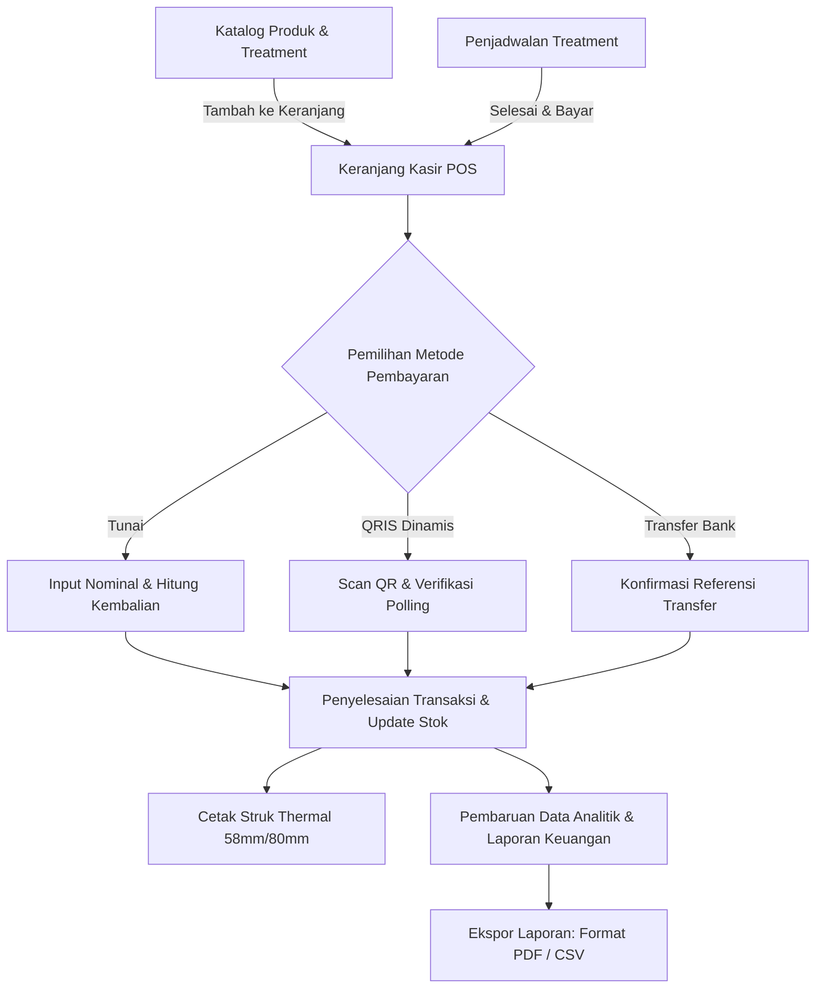

# BeautyPOS - Beauty Salon & Aesthetic Clinic Management System

<div align="center">


**Sistem Kasir (Point of Sale), Manajemen Treatment, Penjadwalan Janji Temu (Booking), dan Analisis Keuangan Berbasis Offline-First untuk Industri Kecantikan dan Estetika.**

</div>

---

## 1. Ringkasan Sistem (Executive Summary)

**BeautyPOS** adalah sistem operasional kasir dan manajemen klinik estetika yang dirancang khusus untuk memfasilitasi kebutuhan bisnis salon kecantikan, klinik estetika medis, spa, dan nail art studio. Sistem ini mengintegrasikan dua model transaksi utama—penjualan produk fisik (ritel/skincare) dan layanan jasa (treatment dengan durasi pengerjaan)—dalam satu alur kerja terpadu.

Arsitektur sistem dibangun dengan pendekatan **Offline-First**, memastikan operasional kasir dan pencatatan transaksi tetap berjalan optimal tanpa ketergantungan pada koneksi internet. Desain antarmuka menerapkan prinsip **Modern Flat Design** dengan kontras tinggi, hierarki visual jelas, dan navigasi responsif.

---

## 2. Fitur Utama

### 2.1. Manajemen Katalog Produk dan Layanan
- **Produk Fisik**: Pengelolaan inventori retail (SKU, barcode, harga modal, harga jual, dan stok minimum dengan peringatan realtime).
- **Layanan / Treatment**: Pengaturan katalog perawatan lengkap dengan durasi estimasi (menit) dan tarif jasa.
- **Pencarian dan Filter Cepat**: Mekanisme filtering instan berdasarkan kategori dan pencarian kata kunci berbasis teks.

### 2.2. Point of Sale (POS) dan Kasir
- **Tampilan Responsif**:
  - *Mode Desktop/Tablet*: Tampilan terbagi (split-view) antara katalog produk/jasa dan panel keranjang transaksi.
  - *Mode Mobile*: Antarmuka grid adaptif dengan keranjang belanja modular (expandable bottom sheet).
- **Kalkulasi Akurat**: Perhitungan subtotal, diskon (persentase maupun nominal tetap), pajak pertambahan nilai (PPN), dan total akhir secara realtime.
- **Validasi Stok Otomatis**: Pencegahan transaksi saat stok produk fisik tidak mencukupi (*oversell protection*).
- **Opsi Multi-Metode Pembayaran**: Mendukung Tunai (lengkap dengan kalkulasi kembalian otomatis), QRIS dinamis, dan Transfer Bank.

### 2.3. Penjadwalan dan Booking Treatment
- **Manajemen Janji Temu**: Pencatatan reservasi klien, informasi kontak, tanggal, jam layanan, dan terapis yang ditugaskan.
- **Siklus Status Booking**: Alur transisi status terstruktur: `Pending` -> `Confirmed` -> `Completed` -> `Cancelled`.
- **Integrasi Kasir Instan**: Tombol "Selesai & Bayar" yang secara langsung mengimpor data treatment yang telah diselesaikan ke dalam keranjang kasir POS tanpa penginputan ulang.

### 2.4. Simulator Pembayaran QRIS Dinamis
- **QR Generator Terintegrasi**: Pembuatan payload dan rendering QR Code dinamis berbasis standar EMVCo/QRIS menggunakan `qr_flutter`.
- **Sistem Simulasi Verifikasi**: Mekanisme polling interval lokal untuk mensimulasikan perubahan status pembayaran (`Pending` -> `Success`) guna kebutuhan pelatihan staf dan demonstrasi operasional tanpa integrasi gateway pihak ketiga.

### 2.5. Cetak Struk Bluetooth Thermal Printer
- **Standar Format ESC/POS**: Pembuatan template struk terstandarisasi untuk lebar kertas **58mm** dan **80mm**.
- **Kompatibilitas Multi-Platform**:
  - *Android / iOS*: Deteksi dan koneksi perangkat printer via Bluetooth menggunakan `print_bluetooth_thermal`.
  - *Desktop / Web*: Simulator struk digital interaktif untuk pratinjau cetak.

### 2.6. Analitik dan Laporan Keuangan
- **Key Performance Indicators (KPI)**: Informasi ringkas mengenai total pendapatan harian, volume transaksi, rata-rata nilai transaksi (*average ticket size*), dan total item terjual.
- **Visualisasi Tren Pendapatan**: Grafik batang interaktif untuk memantau pergerakan omset 7 hari terakhir (*rolling revenue*) menggunakan `fl_chart`.
- **Peringkat Penjualan**: Laporan peringkat produk dan layanan terlaris (*top-selling items*) berdasarkan kuantitas transaksi.

### 2.7. Ekspor Laporan Penjualan
- **Dokumen PDF**: Rekapitulasi transaksi dalam format dokumen A4 resmi, siap cetak atau diarsipkan.
- **Spreadsheet CSV**: Format data terstruktur untuk integrasi dan analisis lanjutan pada spreadsheet (Microsoft Excel / Google Sheets).
- **Distribusi File**: Pemanfaatan *system share sheet* pada mobile dan download langsung pada platform web.

---

## 3. Sistem Desain dan Antarmuka

Antarmuka BeautyPOS dirancang dengan palet warna terstandarisasi untuk menciptakan identitas visual yang profesional, bersih, dan konsisten:

| Komponen Warna | Nilai Hex | Penggunaan |
|---|---|---|
| **Primary (Electric Blue)** | `#3A86FF` | Tombol aksi utama (CTA), status aktif, fokus formulir |
| **Secondary (Periwinkle)** | `#BDB2FF` | Aksen sekunder, penanda kategori treatment |
| **Accent Pink (Soft Pastel)** | `#FFD6E0` | Label status ringan, indikator pendukung, badge |
| **Background (Warm Porcelain)** | `#FFF4F4` | Kanvas latar belakang utama aplikasi |
| **Surface** | `#FFFFFF` | Latar belakang kartu, dialog, dan panel input |
| **Text Primary (Slate Navy)** | `#1E202A` | Tipografi utama untuk keterbacaan optimal |
| **Text Secondary** | `#6B7280` | Tipografi sekunder untuk label dan metadata |

### Komponen Interaktif:
- **InteractiveCard**: Komponen kartu dengan respons mikro-animasi saat disentuh/ditekan.
- **ModernSegmentedControl**: Komponen pemilihan tab modular dengan indikator transisi geser.
- **FlatBadge**: Label status dan kategori berbasis desain datar tanpa ornamen berlebih.
- **Tipografi**: Menggunakan keluarga font *Plus Jakarta Sans* untuk keterbacaan data numerik dan teks profesional.

---

## 4. Arsitektur Teknis dan Struktur Kode

Aplikasi ini menerapkan pemisahan tanggung jawab yang modular (*feature-first architecture*):

```
lib/
├── core/
│   ├── database/        # DatabaseHelper (SQLite FFI Desktop + SQLite Mobile + Web FFI)
│   ├── shell/           # AppShell, NavigationRail responsif, dan BottomNavigation
│   ├── theme/           # AppTheme, AppColors, dan konfigurasi tipografi
│   ├── utils/           # Format mata uang (IDR) dan format penanggalan
│   └── widgets/         # Komponen UI global (InteractiveCard, FlatBadge, dll.)
│
├── features/
│   ├── catalog/         # Model data, state provider, repositori, dan UI Katalog
│   ├── pos/             # State manajemen keranjang belanja, kalkulasi, dan kasir
│   ├── booking/         # Penjadwalan reservasi dan integrasi pembayaran treatment
│   ├── payment/         # Generator QRIS dan modul simulasi transaksi
│   ├── printer/         # Generator byte ESC/POS dan antarmuka printer thermal
│   └── reports/         # Dashboard analitik, visualisasi fl_chart, dan ekspor laporan
│
└── main.dart            # Titik masuk aplikasi dan inisialisasi environment
```

### Rincian Dependensi:
- **Framework UI**: Flutter (Material 3 enabled)
- **State Management**: `flutter_riverpod` (v2.6.1)
- **Database Engine**: `sqflite` (v2.4.1), `sqflite_common_ffi` (v2.3.4+4), `sqflite_common_ffi_web` (v1.1.2)
- **Komponen Grafik**: `fl_chart` (v0.70.2)
- **Driver Hardware Printer**: `print_bluetooth_thermal` (v1.1.2), `esc_pos_utils_plus` (v2.0.4)
- **Modul Ekspor**: `pdf` (v3.11.1), `csv` (v6.0.0), `share_plus` (v10.1.4)
- **Generator Kode QR**: `qr_flutter` (v4.1.0)
- **Tipografi**: `google_fonts` (Plus Jakarta Sans)

---

## 5. Panduan Instalasi dan Menjalankan Proyek

### Prasyarat Sistem
- Flutter SDK versi `>= 3.13.2`
- Dart SDK versi `>= 3.0.0`
- Target browser (Google Chrome / Microsoft Edge) atau target desktop (Windows 10/11 dengan dependensi C++)

### Langkah Instalasi

1. **Kloning Repositori**:
   ```bash
   git clone https://github.com/julianfiru/beauty_pos.git
   cd beauty_pos
   ```

2. **Instalasi Dependensi**:
   ```bash
   flutter pub get
   ```

3. **Menjalankan Aplikasi**:

   - **Target Browser (Web)**:
     ```bash
     flutter run -d chrome
     # atau
     flutter run -d edge
     ```

   - **Target Windows Desktop**:
     ```bash
     flutter run -d windows
     ```

   - **Target Android Device / Emulator**:
     ```bash
     flutter run -d android
     ```

---

## 6. Diagram Alur Operasional (Operational Workflow)



---

## 7. Lisensi

Seluruh hak cipta dilindungi. Proyek ini dikembangkan sebagai solusi sistem manajemen point of sale untuk industri estetika dan kecantikan profesional.
